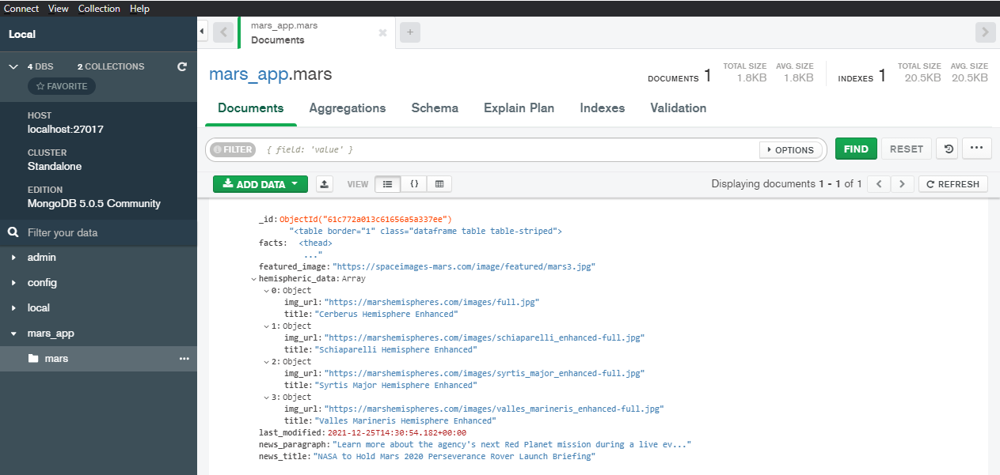
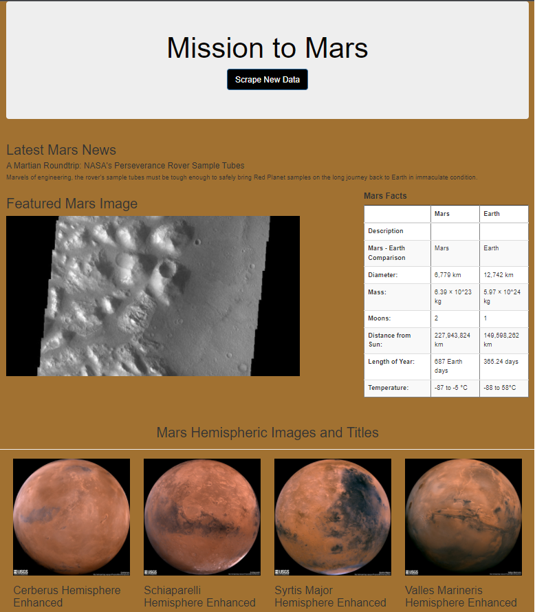

# Mission-to-Mars
Web Scraping using BeautifulSoup, Splinter, MongoDB, Flask, HTML, CSS, ChromeDriverManager, Chrome Developer Tools, Python

## Purpose
In this module we create an automated web scrapping app using various tools to scrap the data from several Mars websites, store the data in MongoDB, and display the data as a web page.

scraping.py is the script used to scrap data from Mars websites. The main steps for doing so are:

- created an instance of a Splinter browser
- created a function for each website needing scraped by:
  - naming the url of each site being to scrape with Splinter
  - converting the browser HTML to an object using Beautiful Soup
  - naming the navigation needing to be followed to capture data needing to scrape using Chrome Developer Tools
  - moving the data into a list of dictionaries (so that they can be stored) using Pandas
  - storing and updating database with data scraped from websites
  
app.py is the scripted used to automate scrape processing using Flask. The main steps for doing so are: 

- connect to your MangoDB mars collection via localhost
- name HTML page rendered
- set-up Flask routes, including the scraping route

The next thing we needed to work with was MongoDB to validate our database collection. MongoDB Compass was used to accomplish this.

Lastly, we created HTML using Bootstrap and our MongoDB mars collection to accomplish the templates/index.html.

